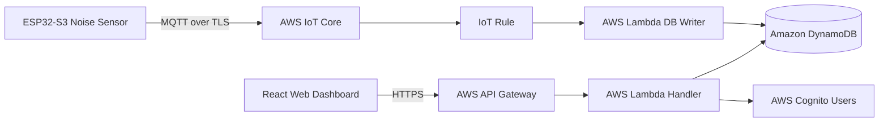

# STEP 01 — SYSTEM_ARCHITECTURE.md

## High Level Architecture
The MVP is a pure serverless IoT architecture designed to eliminate server maintenance costs and maximize scaling capacity up to 100,000 devices.

## Component Boundaries

### 1. Edge Layer (Sensor)
* A single ESP32-S3 microcontroller directly handles the entire edge pipeline.
* Continual acoustic capture -> dBA calculation -> JSON payload publishing via MQTT over Wi-Fi.
* No local media storage or edge inference is required.

### 2. Ingestion & Storage Layer
* **AWS IoT Core:** Manages device connections, TLS termination, and routes messages using SQL-like IoT Rules.
* **Amazon DynamoDB:** Serves as the single operational database, storing telemetry, device registrations, and event logs.
* **Amazon S3:** Hosts the static React frontend dashboard assets.

### 3. Application API Layer
* **Amazon API Gateway:** Exposes RESTful endpoints for the frontend dashboard.
* **AWS Lambda:** Runs backend business logic (authenticating requests, managing thresholds, generating history reports).
* **AWS Cognito:** Handles secure tenant registration, user login, and token generation (JWT).

## Fault Tolerance & Offline Management
* If Wi-Fi connection is temporarily lost, the ESP32-S3 stores the last 1 hour of per-minute dB telemetry in its volatile RAM ring buffer.
* Once the connection is re-established, the device uploads the buffered historical metrics. If power is lost, the unsent volatile buffer is dropped to avoid SD card wear and hardware complexity.