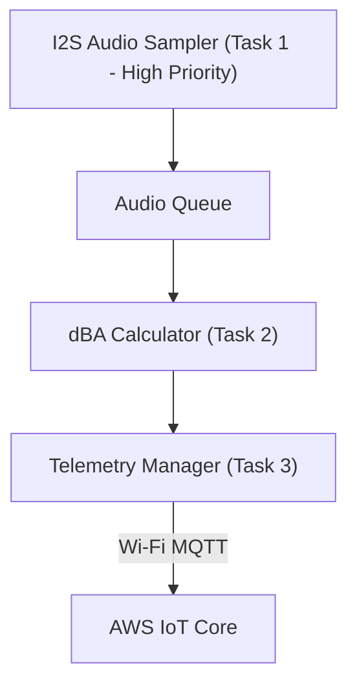

# STEP 03 — EMBEDDED_SOFTWARE.md

## Embedded Software Architecture
The ESP32-S3 firmware is written in C++ using the Arduino core on top of FreeRTOS. This approach lets us leverage massive community libraries for faster shipping.



## FreeRTOS Tasks & Priorities

### 1. Audio Sampling Task (Priority: 5 - High)
* Runs continuously every 10ms.
* Reads raw PCM audio samples from the INMP441 microphone using the ESP32 hardware I2S peripheral.
* Pushes raw audio buffers to a thread-safe FreeRTOS queue.

### 2. dBA Calculation Task (Priority: 3 - Medium)
* Consumes audio blocks from the queue.
* Applies an A-weighting filter to mimic human hearing.
* Calculates the Root Mean Square (RMS) of the filtered samples and converts them to a decibel (dBA) level.
* Pushes the max and average dB values every 1 second to the Telemetry Manager.

### 3. Telemetry & Connection Task (Priority: 1 - Low)
* Aggregates 1-second readings into 1-minute blocks (average dB, peak dB).
* Maintains the Wi-Fi connection and MQTT client.
* Publishes a JSON telemetry payload to AWS IoT Core once per minute:
  ```json
  {
    "device_id": "sn-94a2c",
    "timestamp": 1782848920,
    "avg_db": 62.4,
    "peak_db": 84.1
  }
  ```

## Local Configuration & Connection Wizard

To allow non-technical users to easily configure the device, the onboarding process should require as little manual input as possible.

### First Boot

- On first boot, the ESP32 launches a Wi-Fi Access Point (AP) named `NoiseSensor-XXXX`.
- When a user connects to this Wi-Fi network, a Captive Portal automatically opens (no need to manually enter `http://192.168.4.1`).
- The setup page only asks for:
  - Local Wi-Fi SSID
  - Local Wi-Fi Password

### Device Registration

The device should already have a unique Device ID programmed during manufacturing.

Instead of asking the user for a Tenant ID, the device automatically registers itself with the backend after connecting to the internet.

The administrator associates the device with an organization from the web dashboard by:

- entering the Device ID printed on the device label, or
- scanning a QR code attached to the device.

This removes technical complexity from the installation process and reduces user configuration errors.

### Local Storage

The ESP32 securely stores the following information in Non-Volatile Storage (NVS):

- Wi-Fi SSID
- Wi-Fi Password
- Device ID
- API Endpoint
- Configuration Version

After successfully saving the configuration, the device automatically reboots, connects to the local Wi-Fi network, and begins sending telemetry to the cloud.