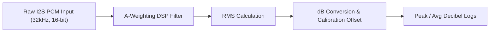

# STEP 04 — AUDIO_ENGINE.md

## Audio Processing Engine
The audio engine runs locally on the ESP32-S3. It is designed for lightweight, low-latency decibel calculations without saving raw voice data to protect user privacy.

## DSP Specifications

### 1. I2S Capture
* **Sample Rate:** 32 kHz (sufficient to capture noise frequencies up to 16 kHz).
* **Resolution:** 16-bit PCM.
* **Buffer Size:** 512 samples per read (16ms windows).

### 2. A-Weighting Filter
* Human ears do not hear all frequencies equally. Noise monitoring laws require dBA scaling, which attenuates very low and very high frequencies.
* Implemented as an infinite impulse response (IIR) second-order cascaded bandpass filter running directly on the ESP32 CPU using floating-point operations.

### 3. Decibel (dB) Calculation
* Compute the Root Mean Square (RMS) of the A-weighted PCM buffer:
  $$x_{\text{RMS}} = \sqrt{\frac{1}{N} \sum_{i=1}^{N} x_i^2}$$
* Convert the RMS value to a logarithmic decibel scale:
  $$\text{dB} = 20 \log_{10}(x_{\text{RMS}}) + \text{Calibration Offset}$$
* **Calibration Offset:** A hardcoded constant matching the specific microphone sensitivity. The offset is adjustable via the cloud configuration manager.

## Noise Threshold Detection
* **Sustained Violation Alert:** If the calculated dB level exceeds a user-configured limit (e.g., 85 dBA) for more than 10 consecutive minutes, the device flags a violation event and sends an immediate MQTT message to trigger the escalation sequence (SMS/Email notification).
