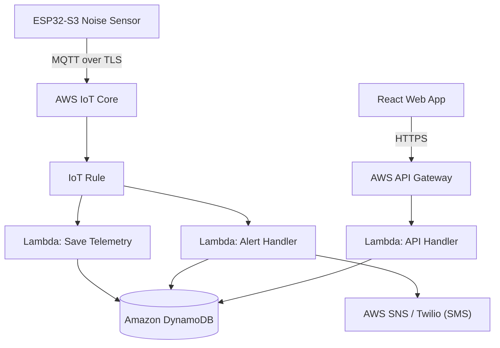

# STEP 07 — CLOUD_BACKEND.md

## Cloud Architecture (Serverless MVP)
The cloud backend uses a 100% serverless AWS stack. This design keeps operational costs near zero for low device fleets and guarantees scalability.



## AWS Services Configuration

### 1. AWS IoT Core
* **MQTT Broker:** Devices connect securely using standard X.509 client certificates.
* **IoT SQL Rule:** Listens to topic `devices/+/telemetry` and routes messages asynchronously to AWS Lambda:
  ```sql
  SELECT *, topic(2) as device_id FROM 'devices/+/telemetry'
  ```

### 2. AWS Lambda (Python 3.13)
* **Save Telemetry Lambda:** Writes per-minute average/peak dBA readings directly into DynamoDB.
* **Alert Handler Lambda:** Checks if a incoming threshold breach payload exceeds configured limits. If a breach persists, it triggers an AWS SNS alert (or calls Twilio API for SMS alerts).
* **API Handler Lambda:** Monolithic-style Lambda function routing API Gateway requests to CRUD operations on DynamoDB (device status, configurations, user settings).

### 3. Amazon DynamoDB
* No-SQL key-value database.
* Scale capacity set to **On-Demand (Pay-per-request)** to ensure zero idle baseline costs.

### 4. AWS Cognito
* Manages user signup, login, tenant organization grouping, and issues JWT tokens for dashboard API authorization.
