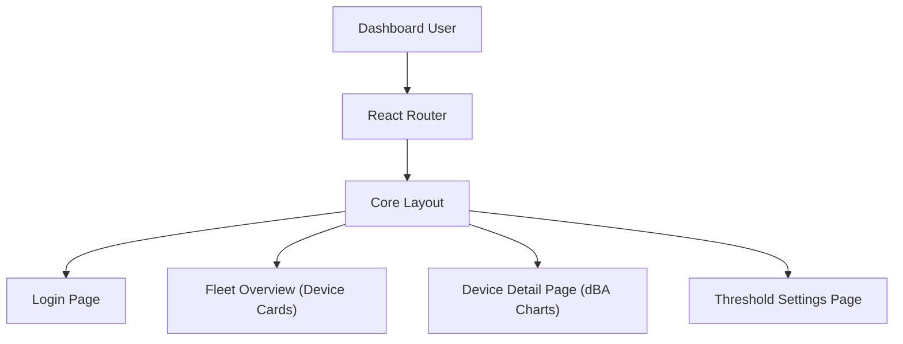

# STEP 11 — REACT_DASHBOARD.md

## React Dashboard Architecture
The dashboard is a single-page application built using React, TypeScript, and Vite. It is deployed as static assets to Amazon S3 and distributed via CloudFront. The layout is optimized to be fully responsive, acting as a Progressive Web App (PWA) to avoid native mobile app development costs.

## Core Features & Components

### 1. Fleet Overview Page
* Displays a grid of registered devices.
* **Component:** `DeviceCard` - Displays device name, live Wi-Fi connection status (online/offline), and real-time dBA level.
* Color codes status indicators (Green: <70 dB, Yellow: 70-80 dB, Red: >80 dB).

### 2. Device Details Page
* Integrates **Chart.js** to plot historical decibel averages and peak levels.
* Displays a date picker enabling users to retrieve 24-hour compliance reports.
* Includes a download option exporting PDF report cards showing quiet hour periods.

### 3. Alarm & Notification Settings
* Provides input forms for users to configure threshold values (e.g., dBA trigger value and sustained duration trigger).
* Includes input fields for SMS alert phone numbers and email distribution lists.

## Frontend Technology Stack
* **Build System:** Vite.
* **CSS Framework:** TailwindCSS (curated premium dark mode layout).
* **State & Data Fetching:** TanStack Query (`@tanstack/react-query`) for caching and automatic server polling.
* **Routing:** React Router DOM.
* **Telemetry Charts:** Chart.js with standard line formatting.
