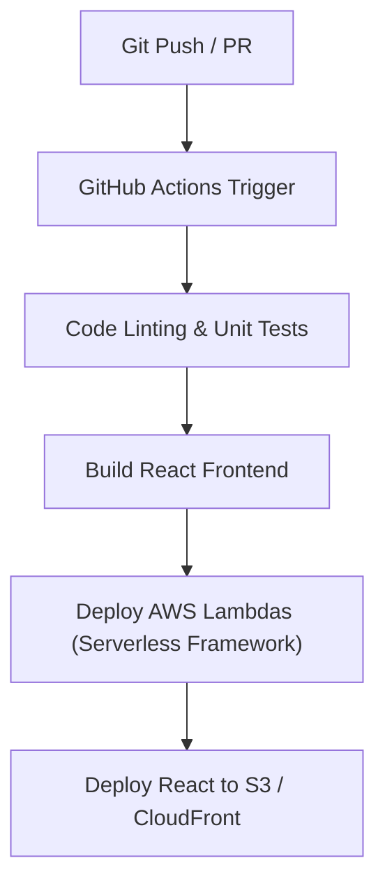

# STEP 15 — CI_CD.md

## CI/CD Pipeline (Lean & Fast)
To ensure rapid iterations and eliminate manual build mistakes, we use a single GitHub Actions workflow file.

## Deployment Actions

### 1. Build and Test
* Triggered on every commit to the `main` branch.
* Runs Python unit tests (for Lambdas) and React tests (Vitest).

### 2. AWS Backend Deployment
* We use **Serverless Framework** (or a single Terraform template) to provision all AWS resources.
* Deploys API Gateway configurations, Lambdas, Cognito user pools, and DynamoDB tables.
* Deploy takes less than 3 minutes.

### 3. Frontend Deployment
* Compiles the React dashboard into static HTML/JS assets (`npm run build`).
* Uploads the build assets directly to the Amazon S3 static website hosting bucket.
* Triggers an invalidation request to the Amazon CloudFront distribution edge nodes so users immediately download the latest frontend.

### 4. Over-The-Air (OTA) Firmware Updates
* In Version 1, OTA updates are managed manually.
* The engineer compiles the new `.bin` binary file and uploads it to an S3 firmware bucket.
* The device fetches this file on boot (or checks a config topic), runs the update, and reboots. This simple check takes 20 lines of C++ code to implement on the ESP32-S3.
