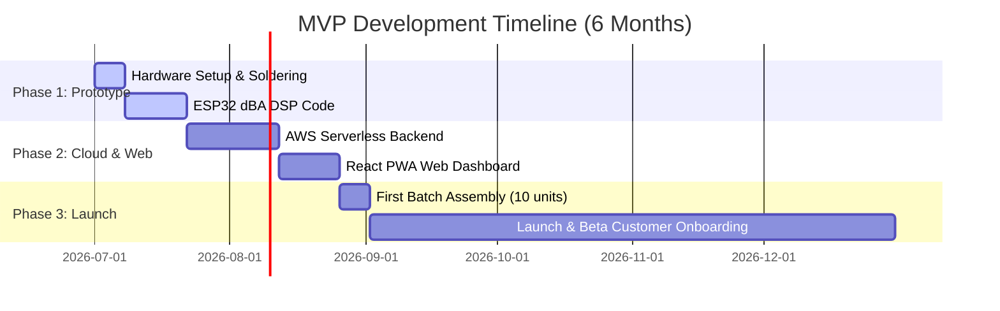

# STEP 19 — ROADMAP.md

## Accelerated Product Roadmap (6 Months, €5,000 Budget)
This roadmap is structured to ensure that we ship a working Version 1 within 2 months, reserving the remaining 4 months of our runway to secure paying customers and refine the product based on feedback.

## Milestone Timeline

### Milestone 1: The Sound Sentinel (Month 1)
* **Goal:** A working prototype of the sensor.
* **Deliverables:** ESP32-S3 firmware calculating dBA levels within $\pm 2$ dB of a commercial sound meter.
* **Cost:** ~€100 (prototyping components and tools).

### Milestone 2: Cloud Ingestion & Alerting (Month 2)
* **Goal:** A fully working dashboard and real-time SMS alerts.
* **Deliverables:** React dashboard hosted on S3 showing live telemetry. Lambdas writing data to DynamoDB. SMS alerts triggering via Twilio/SNS.
* **Cost:** ~€50 (sandbox service fees).

### Milestone 3: Customer Acquisition & Revenue (Months 3 - 6)
* **Goal:** Secure the first 5 paying clients and achieve recurring revenue.
* **Deliverables:** Assemble 10 commercial-ready units. Ship them directly to property managers. Iterate dashboard design based on real host feedback.
* **Cost:** ~€500 (component inventory for the first 25 devices).
* **Cash Flow Runway:** Selling 20 devices generates €2,580 in hardware revenue and €1,920 in annual subscription booking, making the business self-sustaining.
